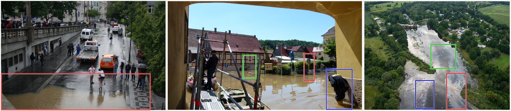
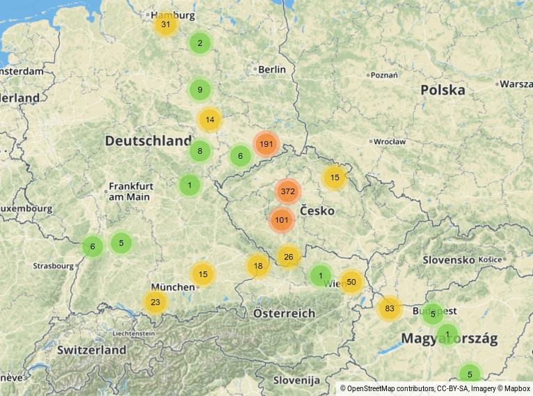
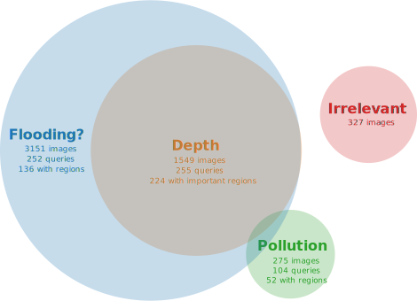

European Flood 2013 Dataset (v1.0)
==================================

This repository contains metadata and annotations of a flood dataset used in the context of interactive
content-based image retrieval. The goal is to retrieve images from a larger amount of data that are
useful to derive a certain type of information.

For this particular dataset, three such information objectives have been defined:

- *Flooding:* Is a certain area flooded or not?
- *Depth:* Derive an estimation of the inundation depth from the image due to visual cues such as, for example,
  traffic signs or other structures with known height.
- *Pollution:* Does the image show any pollution substances like for instance oil?

The majority of the 3,710 images in the dataset relate to the central European floods in May/June 2013 and
have been fetched in July 2017 from the Wikimedia Commons Category
["Central Europe floods, May/June 2013"][1] and its sub-categories, excluding the category
"Transport during 2013 Vltava flood in Prague", which is related to public transportation during
the flood, but does not actually show flooding.
A total of 3,435 images come from this source, 890 of them containing metadata about the geographical
location where the photo has been taken.

As can be seen from the following map, the majority of images for which geolocation information is available
are located in the areas of Dresden (Germany) and Prague (Czech Republic).

275 additional images showing water pollution have been harvested manually by querying online image
search engines for the [major oil spill events of the past few years][2].
While the images from Wikimedia Commons are identified by their page ID, the pollution images are
numbered consecutively from 1 to 275 and their identifiers are prefixed with "pollution_".

Citation
--------

The following paper describes the dataset in detail and conducts initial experiments for interactive
flood image retrieval:

> Björn Barz, Kai Schröter, Moritz Münch, Bin Yang, Andrea Unger, Doris Dransch, and Joachim Denzler.  
> ["Enhancing Flood Impact Analysis using Interactive Image Retrieval of Social Media Images."][11]  
> arXiv:1908.03361, 2019.

If you use the dataset, please cite this paper.

Obtaining the Images
--------------------

We provide two variants of the images in this dataset:
one with the images resized so that the smaller side is at most 512 pixels, whereas the smaller side is limited to 1280 pixels in the second variant.

- [Images resized to 512 pixels][3] (1.1 GB, [mirror][9])
- [Images resized to 1280 pixels][4] (5.6 GB)

To create a realistic image retrieval scenario, distractor images from the Flickr100k dataset are usually
added to this dataset, which can be obtained [here][5].

Relevance Annotations
---------------------

All images in the dataset have been annotated by hydrologists regarding their relevance for each of the
three tasks mentioned above.
Naturally, each image can be relevant for more than one or even no task at all.

The relevance annotations are provided in the directory [`relevance`](relevance/),
which contains one text file for each task.
Each text file contains a list of identifiers of images relevant for this task.
Additionally, the file [`irrelevant.txt`](relevance/irrelevant.txt) lists all images that are not relevant
for any task.

The following Venn diagram illustrates the number of images assigned to each task:

Selected Queries
----------------

For each task, some images that are particularly suitable as query images to be provided as a starting
point for a content-based image retrieval system have been selected.
The identifiers of these images are listed in the text files in the `queries` directory.

Important Image Regions
-----------------------

Some of the images have been annotated with bounding boxes denoting regions which are particularly
important for the relevance of the image.
For example, traffic signs or humans standing in the water could be helpful for determining
inundation depth.

These annotations are provided in the directory [`important_regions`](important_regions/),
which contains a JSON file for each task.
Each JSON file contains a dictionary mapping image identifiers to a set of region groups.
Each group is identified by a number and contains a list of bounding boxes, given by the coordinates
of the top left corner and the width and height of the box.
Both the coordinates and the dimensions of the bounding boxes are given relatively to the dimensions of
the image. Thus, to obtain the actual pixel values, `left` and `width` would have to be multiplied
with the width of the image and `top` and `height` have to be multiplied with its height.

A group consisting of more than a single regions indicates that the regions in this group have to appear together in an image for making it relevant.

Wikimedia Metadata
------------------

The metadata for the images fetched from Wikimedia Commons is provided in the file [`metadata.json`](metadata.json).
It contains an array of objects, each one describing a particular image using the following attributes:

- `pageid`: The ID of the Wikimedia Commons page. Also used as file name of the image file, followed by `.jpg`.
- `title`: The title of the Wikimedia Commons page.
- `url`: URL of the original image.
- `upload_time`: The time when the image has been uploaded, formatted according to ISO 8601.
- `capture_time` (optional): The time when the image has been taken, as specified in the EXIF data of the image.
  It is formatted according to ISO 8601, but lacking specification of the timezone.
- `coordinates` (optional): Object with `lat` and `lon` attributes specifying where the image has been taken.
- `license`: Name of the license of the image.
- `user`: Name of the user who uploaded the image.
- `artist`: Creator of the image (may contain HTML).
- `descriptionurl`: URL to the Wikimedia Commons page of the image.
- `descriptionshorturl`: Short URL to the Wikimedia Commons page of the image.

Pre-computed Features
---------------------

We provide two sets of pre-computed features:
one containing features of the images in this dataset only and the other one containing features for the
images from Flickr100k in addition.

- [Features for this dataset][6] (66.8 MB, [mirror][10])
- [Features for this dataset + Flickr100k][7] (1.8 GB)

Both sets contain 4 pickle files for different types of features:

- `VGG16_relu5_3_pmp.pickle`:  
  Features extracted from the last convolutional layer of VGG16,
  aggregated by Partial Mean Pooling and L2-normalized.
  Images had been resized so that the smaller side was 512 pixels.
- `VGG16_relu5_3_pmp_multires.pickle`:  
  As above, but averaged over 3 different scales of each image (550, 800, 1050).
- `ResNet101_Deep-RMAC.pickle`:  
  Aggregated features of several regions of interest extracted from a ResNet101 fine-tuned for
  object retrieval by Gordo et al. (ECCV 2016).
  Images had been resized so that the smaller side was 512 pixels.
- `ResNet101_Deep-RMAC_multires.pickle`:  
  As above, but averaged over 3 different scales of each image (550, 800, 1050).

Each pickle file contains a dictionary mapping image identifiers to feature vectors.
The identifiers of the images from Flickr100k are prefixed with "Flickr100k_".

For the images from this dataset only, we also provide local features extracted from the last convolutional layer of VGG16 without pooling: [`VGG16_relu5_3.pickle`][8] (240 MB)  
The feature matrices are stored with the channels along the first axis.

[1]: https://commons.wikimedia.org/wiki/Category:Central_Europe_floods,_May/June_2013
[2]: https://en.wikipedia.org/wiki/List_of_oil_spills
[3]: https://archive.org/download/european-flood-2013/european-flood-2013_imgs_small.zip
[4]: https://archive.org/download/european-flood-2013/european-flood-2013_imgs_large.zip
[5]: http://www.robots.ox.ac.uk/~vgg/data/oxbuildings/flickr100k.html
[6]: https://archive.org/download/european-flood-2013/features.zip
[7]: https://archive.org/download/european-flood-2013/features_flickr100k.zip
[8]: https://archive.org/download/european-flood-2013/VGG16_relu5_3.pickle.gz
[9]: https://cloud.uni-jena.de/index.php/s/Tdns4xnw72XoBiN/download?path=%2F&files=european-flood-2013_imgs_small.zip
[10]: https://cloud.uni-jena.de/index.php/s/Tdns4xnw72XoBiN/download?path=%2F&files=features.zip
[11]: https://arxiv.org/pdf/1908.03361
